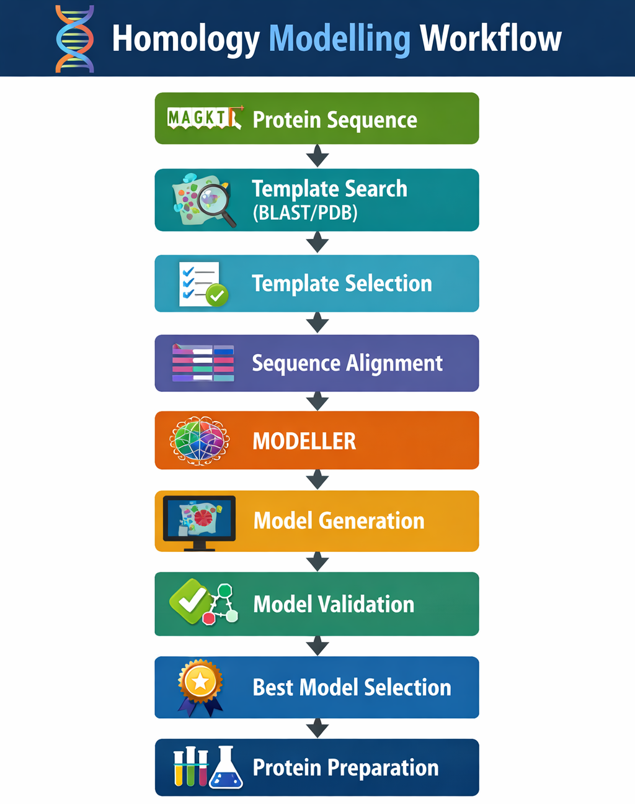
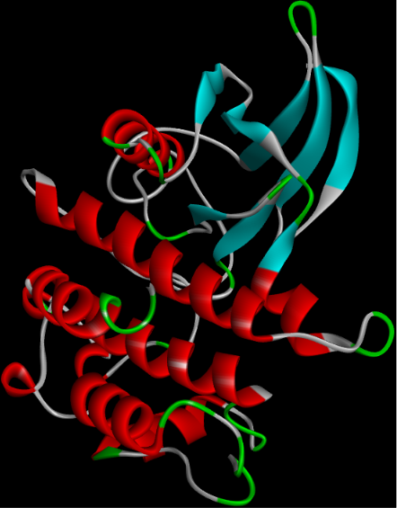
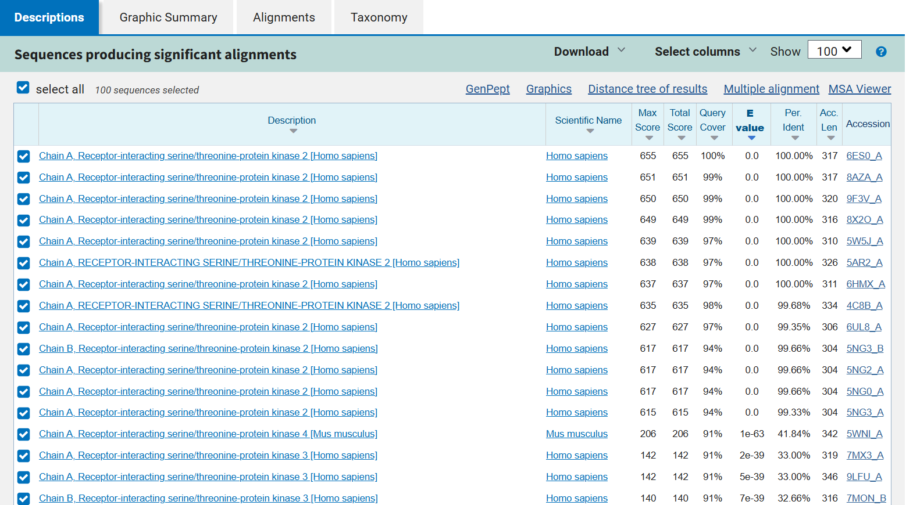
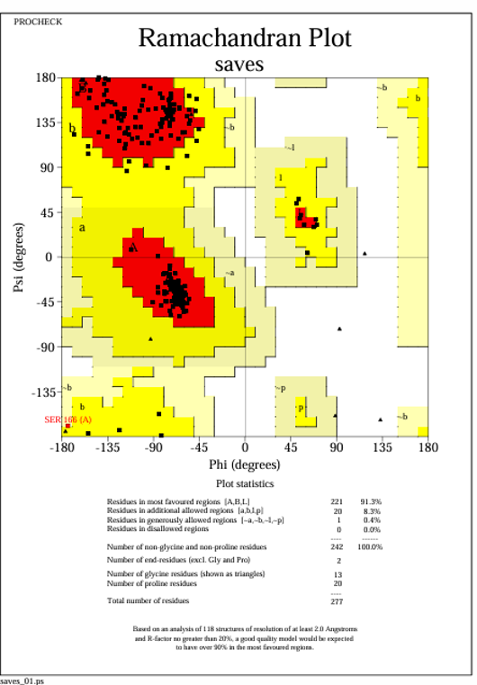
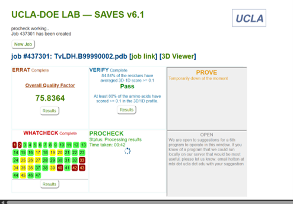

# Homology Modeling

> Comparative protein structure prediction using template-based modeling for computational drug discovery.

---

# Overview

Homology modeling is a computational technique used to predict the three-dimensional structure of a protein based on experimentally resolved homologous structures.

This workflow demonstrates the process of identifying suitable templates, generating structural models using **MODELLER**, validating predicted structures, and preparing them for downstream computational analyses such as molecular docking.

---

# Workflow

---

# Protein Structure

The predicted RIPK2 protein structure generated through homology modeling.

---

# Template Selection

Suitable structural templates were identified through sequence similarity searches against the Protein Data Bank (PDB).

---

# Structural Validation

## Ramachandran Plot

The stereochemical quality of the predicted model was evaluated using PROCHECK.

---

## SAVES Validation

The final model was further assessed using the SAVES server to evaluate structural quality.

---

# Software Used

- MODELLER
- BLAST
- Protein Data Bank (PDB)
- Discovery Studio Visualizer
- PROCHECK
- SAVES v6.1

---

# Learning Outcomes

- Comparative protein modeling
- Template identification
- Sequence alignment
- Structural validation
- Model quality assessment
- Preparation of protein structures for molecular docking

---

# Applications

- Structure-based drug discovery
- Molecular docking
- Protein engineering
- Functional annotation
- Computational structural biology
