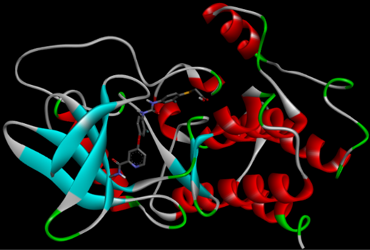
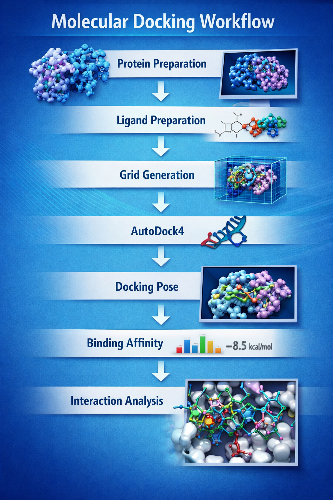

# Molecular Docking

Structure-based molecular docking workflow performed using AutoDock4 for protein–ligand interaction analysis.

## Overview

This project demonstrates a complete molecular docking workflow using AutoDock4 to predict the binding mode and affinity of a ligand against the RIPK2 protein. The workflow includes receptor preparation, ligand preparation, grid generation, docking simulation, result analysis, and automation of post-processing using Python scripts.

## Objectives

- Prepare protein and ligand structures for docking
- Generate docking grid parameters
- Perform molecular docking using AutoDock4
- Identify the best binding pose
- Analyze docking results
- Automate extraction and analysis using Python

## Software Used

| Software | Purpose |
|----------|---------|
| AutoDock4 | Molecular docking |
| AutoDockTools (ADT) | Protein and ligand preparation |
| Discovery Studio Visualizer | Structure visualization |
| Python 3 | Docking result automation |
| GitHub | Documentation and version control |

## Workflow

1. Protein Preparation
2. Ligand Preparation
3. Grid Box Generation
4. AutoDock4 Docking
5. Pose Selection
6. Docking Result Analysis
7. Python-based Post-processing

## Repository Structure

```text
molecular-docking/
│
├── protein/
│   ├── MODEL2.pdb
│   └── MODEL2.pdbqt
│
├── ligand/
│   ├── ligand.pdbqt
│   └── BW8_ideal.sdf
│
├── configuration/
│   ├── grid.gpf
│   └── dock.dpf
│
├── results/
│   ├── dock.dlg
│   └── results.md
│
├── scripts/
│   ├── extract_best_pose.py
│   ├── parse_docking_results.py
│   └── README.md
│
├── figures/
│   ├── 01_docking_workflow.png
│   └── 02_docking_pose.png
│
└── README.md
```

## Key Results

| Parameter | Value |
|-----------|-------|
| Software | AutoDock4 |
| Best Docking Run | Run 4 |
| Best Model | MODEL 4 |
| Best Binding Energy | **-10.25 kcal/mol** |
| Estimated Ki | **30.56 nM** |
| Final Intermolecular Energy | -12.94 kcal/mol |
| vdW + Hydrogen Bond + Desolvation | -13.09 kcal/mol |
| Electrostatic Energy | +0.15 kcal/mol |
| Internal Energy | +0.98 kcal/mol |
| Torsional Free Energy | +2.68 kcal/mol |

## Representative Docking Pose



## Docking Workflow



## Python Utilities

### extract_best_pose.py

Extracts the coordinates of the best-scoring docking pose from an AutoDock4 docking log (`.dlg`) file and saves it as a separate structure for visualization.

### parse_docking_results.py

Automatically parses AutoDock4 docking logs and extracts key docking statistics including:

- Binding Energy
- Estimated Ki
- Best Docking Model
- Docking Run

These scripts improve reproducibility and simplify docking result analysis.

## Skills Demonstrated

- Molecular Docking
- AutoDock4
- Protein Preparation
- Ligand Preparation
- Grid Generation
- Protein–Ligand Interaction Analysis
- Python Scripting
- Scientific Documentation
- Git Version Control
- GitHub Repository Management

## Future Improvements

- Protein–ligand interaction analysis
- Hydrogen bond visualization
- Binding pocket visualization
- Docking comparison with multiple ligands
- Automated docking report generation

## References

1. Morris GM, et al. AutoDock4 and AutoDockTools4: Automated Docking with Selective Receptor Flexibility. *Journal of Computational Chemistry*. 2009.

2. Trott O, Olson AJ. Computational methods for structure-based drug discovery.

3. AutoDock4 Documentation.

4. Discovery Studio Visualizer Documentation.
